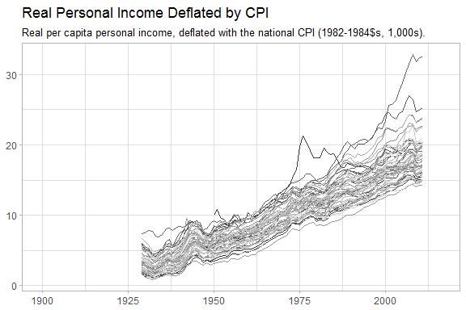

Introduction
------------

This package contains the [Correlates of State Policy](http://http://ippsr.msu.edu/public-policy/correlates-state-policy) dataset, which

> ... includes more than seven-hundred variables, with observations across the U.S. 50 &gt; states and time (1900 – 2016). These variables represent policy outputs or &gt; political, social, or economic factors that may influence policy differences &gt; across the states. The codebook includes the variable name, a short description &gt; of the variable, the variable time frame, a longer description of the variable, &gt; and the variable source(s) and notes.

Suggested citation:

> Jordan, Marty P. and Matt Grossmann. 2016. The Correlates of State Policy Project v.1.0. East Lansing, MI: Institute for Public Policy and Social Research (IPPSR).

The package allows the user to load and work with the dataset using the R programming language.

Example use
-----------

``` r
library(csp)
library(ggplot2)

data(csp, package = "csp")
dim(csp)
```

    ## [1] 4385745      13

``` r
names(csp)
```

    ##  [1] "year"          "st"            "stateno"       "state"        
    ##  [5] "state_fips"    "state_icpsr"   "variable"      "value"        
    ##  [9] "var_desc"      "dates"         "var_long_desc" "sources_notes"
    ## [13] "topic"

``` r
csp[1:2, ]
```

    ##   year st stateno   state state_fips state_icpsr      variable value
    ## 1 1900 AK       2  Alaska          2          81 pollib_median  <NA>
    ## 2 1900 AL       1 Alabama          1          41 pollib_median  <NA>
    ##                                 var_desc       dates
    ## 1 State Policy Liberalism Score - Median 1936 - 2014
    ## 2 State Policy Liberalism Score - Median 1936 - 2014
    ##                                                                                                                                                                  var_long_desc
    ## 1 Relying on a dynamic latent-variable model to model 148 policies collected over eight decades, the authors produce a yearly measure of the policy liberalism of U.S. states.
    ## 2 Relying on a dynamic latent-variable model to model 148 policies collected over eight decades, the authors produce a yearly measure of the policy liberalism of U.S. states.
    ##                                                                                                                                                                                                                                                     sources_notes
    ## 1 Caughey, Devin, and Christopher Warshaw. 2015. "The Dynamics of State Policy Liberalism, 1936-2014." American Journal of Political Science, September. doi: 10.1111/ajps.12219. https://dataverse.harvard.edu/dataset.xhtml?persistentId=doi:10.7910/DVN/ZXZMJB
    ## 2 Caughey, Devin, and Christopher Warshaw. 2015. "The Dynamics of State Policy Liberalism, 1936-2014." American Journal of Political Science, September. doi: 10.1111/ajps.12219. https://dataverse.harvard.edu/dataset.xhtml?persistentId=doi:10.7910/DVN/ZXZMJB
    ##               topic
    ## 1 I. POLICY OUTPUTS
    ## 2 I. POLICY OUTPUTS

``` r
df <- subset(csp, variable == "real2_pc_inc_quar")
df$value <- as.numeric(df$value)

ggplot(df, aes(x = year, y = value, color = state)) +
  geom_line(show.legend = FALSE) +
  scale_color_grey() +
  theme_light() +
  labs(x = NULL, y = NULL,
       title = df$var_desc[1],
       subtitle = df$var_long_desc[1])
```



Disclaimer
----------

This package is not affiliated with, nor endorsed by, the Correlates of State Policy Project. All credit go to the original authors, and questions should be directed to them. Please check the [official website](http://ippsr.msu.edu/public-policy/correlates-state-policy) for further details on citations, etc.
